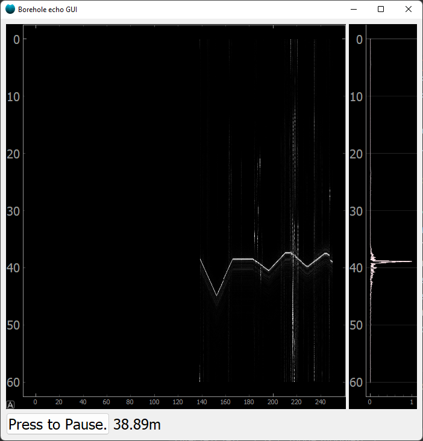

At EastGRIP we want to sense the liquid level in the borehole using sound. This project is intended as a GUI for a software that sends out a chirp every ~2secs and records the echo and visualizes it. 

# file overview

* gui.py: the main file with the quite simple GUI.
* playrec_worker.py: a worker that plays and records chirps. It runs in its own thread to minimize the chance of audio buffer under-runs (which is harder when we use low latency audio = small buffers). It triggers a signal whenever a full trace has been recorded.  
* settings.py: misc settings 
* find_sounddevices.py: used to find the first/best matching device from a prioritized list of device names. 

## dependencies
numpy, pyqt, pyqtgraph, sounddevice

... and perhaps an ffmpeg executable for stream recording (not yet implemented).

## TODO:

* record all inputs to a file. Ideally compressed in some way. I'm not happy with python libraries for this - many dont seem to be designed to deal with infinite audio streams or they seem to be too fragile (dependency hell). So i would prefer to simply pipe audio data to ffmpeg. See the currently_unused_code/stream_encoder.py i have a little test showing how you can pipe data to ffmpeg and it will encode it as an ogg file. This functionality should probably be encapsulated in a separate worker thread so that it does not interfere with the GUI too much. 
* move more options (like chirp settings) to settings.py
 
* Additional latency compensation / Tare button. At the moment playrecworker has some latency compensation based on the system reported latency. However that is just an estimate of the system latency, and there are probably additional latencies in the system somewhere. Latency translates to a depth offset. The speaker and mic will be placed right next to each other, so we should be able to detect the latency from the time to first/maximal peak. 

## screenshot

This screenshot shows a test trace where my laptop mic is recording the audio from my bluetooth headset. Bluetooth inherently has a long latency so the peak shows up at ~40m. we see the latency drifting - that is a 'feature' of the bluetooth protocol. 

Aslak Grinsted 2023
